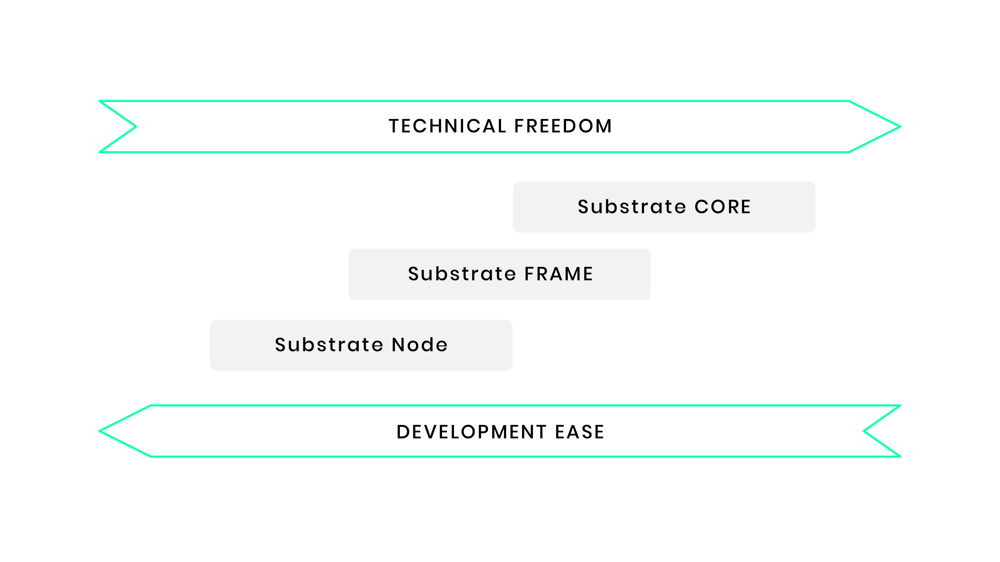

本文是Substrate文档的顶层入口

> **一些专业知识是需要的**
> 为了充分利用Substrate，您应该对区块链概念和基本密码学有很好的了解。 例如：区块头，区块，客户端，哈希，交易和签名等术语应该很熟悉。 目前，您还需要具备Rust开发知识，才能采用 Substrate 进行定制化（尽管最终，我们的目标并非如此）

Substrate 是具有完全通用的状态转换功能（[STF](knowledgebase/getting-started/glossary#stf-state-transition-function): State Transition Function）的区块链开发框架和用于共识，网络和配置的模块化组件。
 
由于它是“完全通用的”，因此它定义了标准和约定（尤其是Substrate运行时模块库-又名[FRAME](knowledgebase/runtime/frame.md)，它为STF提供底层的基础数据结构），从而使快速开发区块链成为现实。
，

## 用法

Substrate 被设计可通过以下三种方式之一使用：

1. **使用 Substrate 节点**: 您可以运行预先设计好的Substrate节点，并配置使用包含默认节点运行时的创世块。 在这种情况下，您只需要配置JSON文件就可以启动一个自己链。 此时拥有的很少的可定制性，仅仅允许你更改运行时模块的初始参数，比如：余额，质押（staking），出块周期，费用，治理。关于这部分的教程，请参考[用 Substrate启动一个私有网络](tutorials/start-a-private-network/index.md)

2. **使用 Substrate FRAME**: 您可以使用 FRAME 轻松创建自己的自定义区块链。 你有极大自由度来编写自己的区块链逻辑，你可以更改数据类型，从模块库中进行选择或添加自己的自定义模块。如果是不触及区块生成逻辑（因为它是通过链上逻辑进行的）下的很多修改，就可以使用现有的Substrate二进制文件进行出块和同步。 如果需要修改出块逻辑，则必须将新的出块构建出独立的项目二进制文件，并由验证者使用。这也是Polkadot中继链（relay）的构建方式，并且在不久的将来几乎可以满足所有需求。这里有一个教程：[创建第一条Substrate链](tutorials/create-your-first-substrate-chain/index.md)

3. **使用 Substrate Core**: 你可以忽略所有的[FRAME](knowledgebase/runtime/frame.md)，从零开始设计和实现运行时。可以使用任何能生成 WebAssembly的语言来完成。 
如果运行时可以与Substrate节点的抽象区块生成逻辑兼容，那么您可以简单地从Wasm Blob构建一个新的创世纪块，并使用现有的基于Rust的Substrate客户端启动链。
如果没有，那么您将需要更改客户端的区块生成逻辑，甚至可能会更改区块头和块序列化格式。就开发工作而言，这是迄今为止使用Substrate最为困难的方法，同时也为您提供了最大的创新自由。

## 下一步

### 学习更多

- 阅读开发文档：[使用 FRAME 进行模块开发](knowledgebase/runtime/frame.md).

### 示例

- 跟随教程：[创建第一条基于 Substrate 的区块链](tutorials/create-your-first-substrate-chain/).

- 跟随教程：[用 Substrate 启动一个私有网络](tutorials/start-a-private-network/).

- 跟随教程：[为 Substrate 运行时添加一个运行时模块](tutorials/add-a-pallet-to-your-runtime/).

### 引用文档

- 前往 [Rust 引用文档](https://crates.parity.io).
